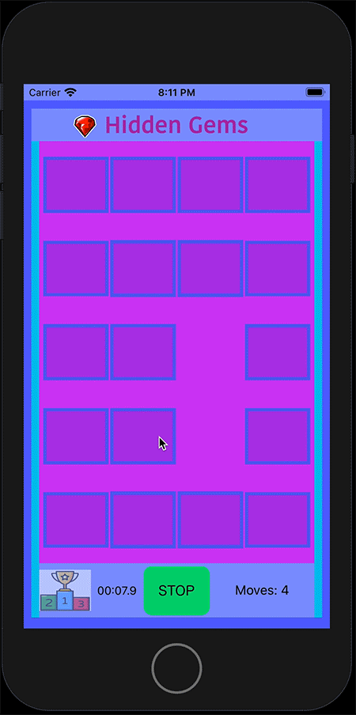
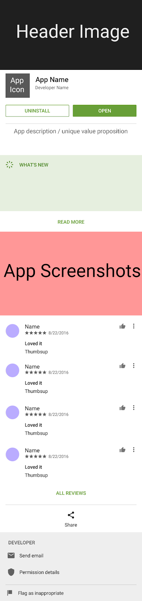

<h1 align="center">Hello, I'm Emil Shenoda</h1>
<h3 align="center">I'm currently working on a Bachelor's Degree in Mobile Development at Full Sail University.</h3>

<p align="center">
  
</p>


## Table of contents

* [Status](#status)
* [iOS Examples](#ios-examples)
* [Android Examples](#android-examples)
* [Associate's Degree Courses](#associate-degree-program)
* [Bachelor's Degree Courses](#bachelor-degree-program)
* [Project Courses](#project-and-portfolio)
* [Copyright](#copyright)
* [Contact](#contact)


## Status


<h3 style="bold"> <font color="green"> Current GPA: 3.96  </font> </h4>


Current Course: Bachelor's Degree Final Project


## iOS Examples

<h2 align="center">Card Matching Game</h3>

<p align="center"> <a href="https://developer.apple.com/swift/" target="_blank" rel="noreferrer"> &nbsp;&nbsp;&nbsp;&nbsp;&nbsp;&nbsp&nbsp; </a>  <a href="https://firebase.google.com/" target="_blank" rel="noreferrer"> &nbsp;&nbsp;&nbsp;&nbsp;&nbsp;&nbsp&nbsp; </a> <a href="https://git-scm.com/" target="_blank" rel="noreferrer">  &nbsp;&nbsp;&nbsp;&nbsp;&nbsp;&nbsp&nbsp;</a>  <a href="https://developer.apple.com/swift/" target="_blank" rel="noreferrer">  </a> </p>

__Main concepts__: 

* Core Data
* UITapGestureRecognizers
* Stack Views
* Button Collections
* Custom HeaderFooterViews
* Custom TableView Cells
* Size Classes for iPhone & iPad
* Swift Timers
* User Interface Idiom
* AVAudioPlayer
* Custom Animation


__Extra functionality to add to the user experience__:


AudioPlayer


```Swift
// Audio Player
func playSound(sound: String, type: String = "mp3") {
        if let path = Bundle.main.path(forResource: sound, ofType: type) {
            do {
                let url = URL(fileURLWithPath: path)
                audioPlayer = try AVAudioPlayer(contentsOf: url)
                audioPlayer?.play()
            } catch {
                print("ERROR")
            }
        }
    }
```


__Load Game Animation__

<p align="center">
  
</p>


___


__Animations for pulsating Start / Stop button__

__Flashing Colors__

<p align="center">
  
</p>

<p align="center">
  
</p>


___


__Card Shake Animation__

<p align="center">
  
</p>


___


__Custom Segue Transition__

<p align="center">
  
</p>


___

__Layout Changes__

<p align="center">
  
</p>


___


__iPad: Add Progress Bar / 10 Extra Cards__


<p align="center">
  
</p>


## [Click Here to View More iOS Illustrations](https://github.com/EShenoda/iOS-Illustrations)


## Android Examples

<p align="center"> <a href="https://developer.android.com" target="_blank" rel="noreferrer"> &nbsp;&nbsp;&nbsp;&nbsp;&nbsp;&nbsp&nbsp;<a href="https://firebase.google.com/" target="_blank" rel="noreferrer"> &nbsp;&nbsp;&nbsp;&nbsp;&nbsp;&nbsp&nbsp; </a> <a href="https://git-scm.com/" target="_blank" rel="noreferrer">  &nbsp;&nbsp;&nbsp;&nbsp;&nbsp;&nbsp&nbsp;</a> <a href="https://www.java.com" target="_blank" rel="noreferrer">  </a> </p>

### Advanced Layout Design

__Main concept__: Build a Google Play Store mockup.


Topics of research:

* Material Design
* Nested Layouts
* Parallax collapsing toolbar layout

<p align="center">
  
&nbsp;&nbsp;&nbsp;&nbsp;&nbsp;&nbsp&nbsp;&nbsp;&nbsp;&nbsp;&nbsp&nbsp&nbsp;&nbsp;

</p>


### Media Playback

__Main concept__: Build a media player app that plays songs in sequence. The application should be able to run while closed by using a foreground service. Some of the playback functionality will also be accessible through a notification. Notification allows the user to skip to previous or next song.


Topics of research:

* Media Player Class
* Finite State Machine
* Foreground Services 
* Expanded Style Notifications
* Audio Playback
* Seekbars & Runnables
* Raw Resources
* Retrieve meta-data from media file

<p align="center">
  
&nbsp;&nbsp;&nbsp;&nbsp;&nbsp;&nbsp&nbsp;&nbsp;&nbsp;&nbsp;&nbsp&nbsp&nbsp;&nbsp;

</p>


<p align="center">
  
</p>


<p align="center">
  
</p>


<p align="center">
  
</p>


## [Click Here to View More Android Illustrations](https://github.com/EShenoda/Android-Illustrations)


<h4 align="center"> <font color="red"> **Links to Degree Program & Portfolio Courses require a GitHub account. Private repositories are available for collaborators. </font> </h4>


## Associate Degree Program

<h4> Visual Studios Platform </h4>

<p align="left"> <a href="https://developer.android.com" target="_blank" rel="noreferrer"> &nbsp;&nbsp;&nbsp;&nbsp;&nbsp;&nbsp&nbsp; </a> <a href="https://www.w3schools.com/cs/" target="_blank" rel="noreferrer">  &nbsp;&nbsp;&nbsp;&nbsp;&nbsp;&nbsp&nbsp;</a> <a href="https://git-scm.com/" target="_blank" rel="noreferrer"> &nbsp;&nbsp;&nbsp;&nbsp;&nbsp;&nbsp&nbsp; </a> </a> <a href="https://www.mysql.com/" target="_blank" rel="noreferrer">  </p>

[Scalable Data Infrastructures](https://github.com/EShenoda/SDI)

[Advanced Scalable Data Infrastructures](https://github.com/EShenoda/ASD)

[Visual Frameworks](https://github.com/EShenoda/VFW)

___

## Bachelor Degree Program

<h4> iOS Platform </h4>

<p align="left"> <a href="https://developer.apple.com/swift/" target="_blank" rel="noreferrer"> &nbsp;&nbsp;&nbsp;&nbsp;&nbsp;&nbsp&nbsp; </a>  <a href="https://firebase.google.com/" target="_blank" rel="noreferrer"> &nbsp;&nbsp;&nbsp;&nbsp;&nbsp;&nbsp&nbsp; </a> <a href="https://git-scm.com/" target="_blank" rel="noreferrer">  &nbsp;&nbsp;&nbsp;&nbsp;&nbsp;&nbsp&nbsp;</a>  <a href="https://developer.apple.com/swift/" target="_blank" rel="noreferrer">  </a> </p>

[iOS](https://github.com/EShenoda/iOS)

[iOS Development I](https://github.com/EShenoda/iOS-Development-I)

[iOS Development II](https://github.com/EShenoda/iOS-Development-II)

[iOS Project](https://github.com/EShenoda/iOS-Project)

<h4> Android Platform </h4>

<p align="left"> <a href="https://developer.android.com" target="_blank" rel="noreferrer"> &nbsp;&nbsp;&nbsp;&nbsp;&nbsp;&nbsp&nbsp;<a href="https://firebase.google.com/" target="_blank" rel="noreferrer"> &nbsp;&nbsp;&nbsp;&nbsp;&nbsp;&nbsp&nbsp; </a> <a href="https://git-scm.com/" target="_blank" rel="noreferrer">  &nbsp;&nbsp;&nbsp;&nbsp;&nbsp;&nbsp&nbsp;</a> <a href="https://www.java.com" target="_blank" rel="noreferrer">  </a> </p>

[Google Programming Language](https://github.com/EShenoda/GPL)

[Advanced Interface Design](https://github.com/EShenoda/AID)

[Android Development I](https://github.com/EShenoda/Android-Development-I)

[Android Development II](https://github.com/EShenoda/Android-Development-II)

___

## Project and Portfolio

### [Project & Portfolio I](https://github.com/EShenoda/Portfolio-I)

<p align="left">    


### [Project & Portfolio II](https://github.com/EShenoda/Portfolio-II)

<p align="left">     </p>


### [Project & Portfolio III](https://github.com/EShenoda/Portfolio-III)

<p align="left"> 

### [Project & Portfolio IV](https://github.com/EShenoda/Portfolio-IV)

<p align="left">       </p>


### [Project & Portfolio V](https://github.com/EShenoda/Portfolio-V)

<p align="left">      </p>

##  Copyright
Private Repo for ESShenoda@student.fullsail.edu

All rights reserved: EmilShenoda@FullSailUniversity

## Contact
Created by [Emil Shenoda](mailto:eshenoda247@gmail.com) - feel free to contact me!

[Back to top](#Table-of-contents)