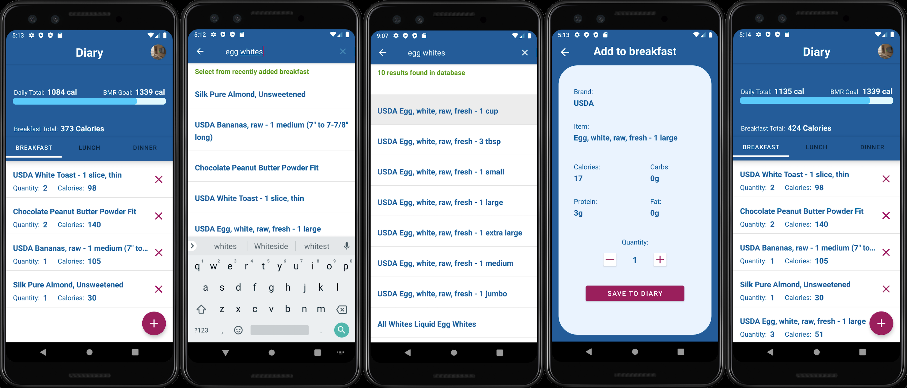

<h2 align="center">Hello, I'm Emil Shenoda</h1>
<h3 align="center">I received a Bachelor's Degree in Computer Science from Full Sail University.</h3>

  

## Table of contents

* [About](#about)
* [Status](#status)
* [Android Project](#android-project)
* [Project Overview](#project-overview)
* [Demo Video](#demo-video)
* [Project Illustrations](#project-illustrations)
* [Quick Links](#quick-links)
* [Associate's Degree Courses](#associate-degree-program)
* [Bachelor's Degree Courses](#bachelor-degree-program)
* [Portfolio Courses](#project-and-portfolio-courses)
* [Copyright](#copyright)
* [Contact](#contact)

## About

I graduated from Full Sail University with bachelor’s degree in computer science. I majored in Mobile Development. I specialize in Android and iOS mobile development. I am proficient in C# and SQL / NoSQL databases.

Full Sail has taught me to learn and apply difficult programming concepts in a fast-paced learning environment. There is so much more to learn. I am studying new programming languages and frameworks so that I can become a valuable member of your team.

## Status

### Full Sail University 

Graduated: Valedictorian GPA: __3.97__

_Currently studying SwiftUI, Kotlin, Spring, React, and React Native._
_________________________________________________________________________

 

## Android Project

 <a href="https://developer.android.com" target="_blank" rel="noreferrer"> &nbsp;&nbsp;&nbsp;&nbsp;&nbsp;&nbsp&nbsp;<a href="https://firebase.google.com/" target="_blank" rel="noreferrer"> &nbsp;&nbsp;&nbsp;&nbsp;&nbsp;&nbsp&nbsp; </a> <a href="https://git-scm.com/" target="_blank" rel="noreferrer">  &nbsp;&nbsp;&nbsp;&nbsp;&nbsp;&nbsp&nbsp;</a> <a href="https://www.java.com" target="_blank" rel="noreferrer">  

### Integrated Product Development

> This is our final project for the Development Track.
> We will explore new concepts and develop an application from idea to completion.

## Project Overview

       

          

 

App Name:  

 

Vision Statement:

 

> __'Right click'__ and open Google Drive link in new tab

[Original Project Plan Document](https://drive.google.com/file/d/1Msz3pSTRe3Hj-TPWF09JVOK9CdPYJb9B/view?usp=sharing)

#### Integrative Project Research

> __'Right click'__ and open Google Drive link in new tab

[Features, Tasks & Time Estimates Spreadsheet](https://docs.google.com/spreadsheets/d/1XiJaIXxIAC8mifm_rSolv5VZbn8q9-nqhhrD8gu9mRw/edit?usp=sharing)

[Project Tracking Spreadsheet](https://docs.google.com/spreadsheets/d/1hUE-mkvimY-_xrqy6vG_wUyBSOOPSHnu/edit?usp=sharing&ouid=115860969731833325173&rtpof=true&sd=true)

[Market Plan](https://drive.google.com/file/d/10BJD837w-vrXqDpHFxGQhjt9GKKBhEia/view?usp=share_link)

#### Proof of Concept

> __'Right click'__ and open Google Drive link in new tab

[Adobe XD Prototype link](https://xd.adobe.com/view/b18b3a9f-1aaf-48bd-8920-d2ce69a635b9-e4d8/)

## Demo Video

> __'Right click'__ and open Google Drive link in new tab

[Demo Video Overview](https://drive.google.com/file/d/1o4Sbp3VOvPiWayIpUaSNTQa9TplGdD05/view?usp=share_link)

## Project Illustrations

### Activities & Fragments

#### Application Launch
 

  
&nbsp;&nbsp;&nbsp;&nbsp;&nbsp;&nbsp&nbsp;&nbsp;&nbsp;&nbsp;&nbsp&nbsp&nbsp;&nbsp;

 

  
&nbsp;&nbsp;&nbsp;&nbsp;&nbsp;&nbsp&nbsp;&nbsp;&nbsp;&nbsp;&nbsp&nbsp&nbsp;&nbsp;

 

#### User's BMR Onboarding Guide

  
&nbsp;&nbsp;&nbsp;&nbsp;&nbsp;&nbsp&nbsp;&nbsp;&nbsp;&nbsp;&nbsp&nbsp&nbsp;&nbsp;

 

  

 

#### User's Diary

  
&nbsp;&nbsp;&nbsp;&nbsp;&nbsp;&nbsp&nbsp;&nbsp;&nbsp;&nbsp;&nbsp&nbsp&nbsp;&nbsp;

&nbsp;&nbsp;&nbsp;&nbsp;&nbsp;&nbsp&nbsp;&nbsp;&nbsp;&nbsp;&nbsp&nbsp&nbsp;&nbsp;

 

#### Food Item Search

  

 

#### Barcode Scanner

  
&nbsp;&nbsp;&nbsp;&nbsp;&nbsp;&nbsp&nbsp;&nbsp;&nbsp;&nbsp;&nbsp&nbsp&nbsp;&nbsp;

&nbsp;&nbsp;&nbsp;&nbsp;&nbsp;&nbsp&nbsp;&nbsp;&nbsp;&nbsp;&nbsp&nbsp&nbsp;&nbsp;

 

#### User's Profile

  

 

#### Update User's Profile

  
&nbsp;&nbsp;&nbsp;&nbsp;&nbsp;&nbsp&nbsp;&nbsp;&nbsp;&nbsp;&nbsp&nbsp&nbsp;&nbsp;

 

#### Update User's BMR

  

 

## Quick Links

### [Click Here to View More Android Illustrations](https://github.com/EShenoda/Android-Project)

### [Click Here to View iOS Illustrations](https://github.com/EShenoda/iOS-Game)

### [Click Here to View iOS Illustrations using SwiftUI](https://github.com/EShenoda/SwiftUI)

##

 

## Full Sail University 

  

## ** Links to Program & Portfolio Courses below require a GitHub account.** 
## ** Private repositories are available for collaborators and hiring managers. **

 

## Associate's Degree Program

<h4> Visual Studios Platform </h4>

 <a href="https://developer.android.com" target="_blank" rel="noreferrer"> &nbsp;&nbsp;&nbsp;&nbsp;&nbsp;&nbsp&nbsp; </a> <a href="https://www.w3schools.com/cs/" target="_blank" rel="noreferrer">  &nbsp;&nbsp;&nbsp;&nbsp;&nbsp;&nbsp&nbsp;</a> <a href="https://git-scm.com/" target="_blank" rel="noreferrer"> &nbsp;&nbsp;&nbsp;&nbsp;&nbsp;&nbsp&nbsp; </a> </a> <a href="https://www.mysql.com/" target="_blank" rel="noreferrer">  

[Scalable Data Infrastructures](https://github.com/EShenoda/SDI)

[Advanced Scalable Data Infrastructures](https://github.com/EShenoda/ASD)

[Visual Frameworks](https://github.com/EShenoda/VFW)

## Bachelor Degree Program

<h4> iOS Platform </h4>

 <a href="https://developer.apple.com/swift/" target="_blank" rel="noreferrer"> &nbsp;&nbsp;&nbsp;&nbsp;&nbsp;&nbsp&nbsp; </a>  <a href="https://firebase.google.com/" target="_blank" rel="noreferrer"> &nbsp;&nbsp;&nbsp;&nbsp;&nbsp;&nbsp&nbsp; </a> <a href="https://git-scm.com/" target="_blank" rel="noreferrer">  &nbsp;&nbsp;&nbsp;&nbsp;&nbsp;&nbsp&nbsp;</a>   

[iOS](https://github.com/EShenoda/iOS)

[iOS Development I](https://github.com/EShenoda/iOS-Development-I)

[iOS Development II](https://github.com/EShenoda/iOS-Development-II)

[iOS Project](https://github.com/EShenoda/iOS-Project)

<h4> Android Platform </h4>

 <a href="https://developer.android.com" target="_blank" rel="noreferrer"> &nbsp;&nbsp;&nbsp;&nbsp;&nbsp;&nbsp&nbsp;<a href="https://firebase.google.com/" target="_blank" rel="noreferrer"> &nbsp;&nbsp;&nbsp;&nbsp;&nbsp;&nbsp&nbsp; </a> <a href="https://git-scm.com/" target="_blank" rel="noreferrer">  &nbsp;&nbsp;&nbsp;&nbsp;&nbsp;&nbsp&nbsp;</a>  

[Google Programming Language](https://github.com/EShenoda/GPL)

[Advanced Interface Design](https://github.com/EShenoda/AID)

[Android Development I](https://github.com/EShenoda/Android-Development-I)

[Android Development II](https://github.com/EShenoda/Android-Development-II)

 

## Project and Portfolio Courses

  

### [Project & Portfolio I](https://github.com/EShenoda/Portfolio-I)

     

 

### [Project & Portfolio II](https://github.com/EShenoda/Portfolio-II)

     

 

### [Project & Portfolio III](https://github.com/EShenoda/Portfolio-III)

 

 

### [Project & Portfolio IV](https://github.com/EShenoda/Portfolio-IV)

       

 

### [Project & Portfolio V](https://github.com/EShenoda/Portfolio-V)

       

 

##  Copyright
Private Repo for EmilShenodaDev@gmail.com

All rights reserved: EmilShenoda@FullSailUniversity

## Contact
Created by [Emil Shenoda](mailto:EmilShenodaDev@gmail.com) - feel free to contact me!

[Back to top](#Table-of-contents)